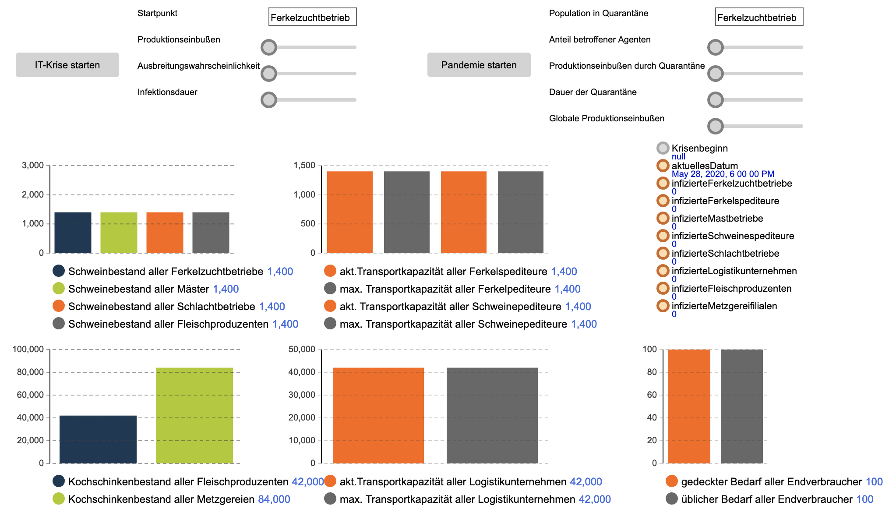

# Simulationsmodell: Rückverfolgung und Rückruf (Szenario Weichkäse)
Das Modell erlaubt die Simulation des Krisenszenarios Kontamintation (Rückverfolgung und Rückruf). Das Modell wurde von Manfred Hofmeier am Institut für Schutz und Zuverlässigkeit der Universität der Bundeswehr München entwickelt.

## Anwendung

Die Krise (Kontamination von Milch) wird mit dem Button "infect milk" bzw. "infect milk permanently" ausgelöst.

Bei "infect milk" wird einmalig eine Charge Milch bei einem zufälligen Milchproduzenten kontaminiert, während die nachfolgenden Chargen wieder kontaminationsfrei sind.

Über "infect milk permanently" kann eine andauernde Kontaminationssituation bei einem zufälligen Milchproduzenten simuliert werden. Diese bleibt solange bestehen, bis die Behörde den Akteur mittels Rückverfolgung ermittelt hat.

Die Behörde beginnt mit der Rückverfolgung, sobald die erste kontaminierte Charge beim Endverbraucher angekommen ist. Die Behörde verfolgt den Warenfluss und zieht kontaminierte Chargen aus dem Verkehr.

### Simulation des potentiellen Einflusses von DLT
Um den möglichen Einfluss der Nutzung von Distributed-Ledger-Technologie (DLT) auf den Verlauf des Krisenszenarios zu untersuchen, kann die Checkbox "use DLT" als Parametereinstellung verwendet werden. Bei aktiviertem Schalter nutzt der Akteur Behörde alternative Prozesse für Rückverfolgung und Rückruf.

## Analyse
Die Resilienz wird in diesem Modell über die folgenden Werte bemessen:
* Gesamtzahl betroffener Konsumenten (contamination affected customers)
* Zahl der Lots, die aus dem Verkehr gezogen wurden (lots withdrawn from circulation)
Es sollten hierbei mehrere Iterationen der Simulation je Parametereinstellung durchgeführt werden, da einige Abläufe von zufälligen Werten abhängen.

## Lizenz

Dieses Werk ist lizenziert unter einer [Creative Commons Namensnennung 4.0 International Lizenz](http://creativecommons.org/licenses/by/4.0/).

## Danksagung
Wir danken dem Bundesministerium für Bildung und Forschung (BMBF) für die Möglichkeit der Forschung im Rahmen des Projektes NutriSafe (FKZ 13N15070 bis 13N15076) sowie dem Sicherheitsforschungsförderprogramm KIRAS, finanziert vom Bundesministerium für Landwirtschaft, Regionen und Tourismus (Projektnummer: 867015).
